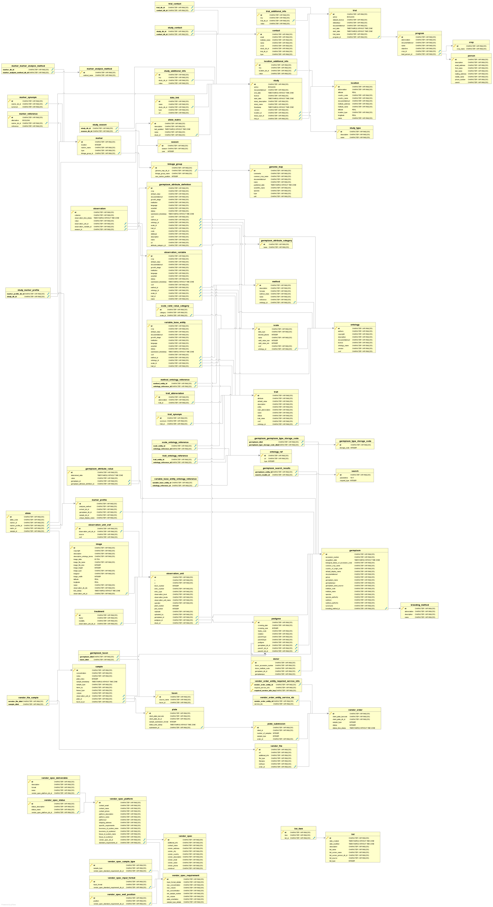

# BrAPI Java Spring-Boot Test Server

## Server Usage
This server implements all BrAPI calls. It is backed by a custom database with dummy data. The base URL is [test-server.brapi.org/brapi/v1/](https://test-server.brapi.org/brapi/v1/).

Use [/calls](https://test-server.brapi.org/brapi/v1/call) to check the available calls.

## Run

### Java IDE
* Checkout the project and open in your favorite Java IDE.
* Run maven to clean and install dependencies `mvn clean install`
* Setup an empty database server (Postgres is recommended). The tables and data will be added on server startup.
* Copy `/src/main/resources/application.properties.template` to `/src/main/resources/properties/application.properties`
* Edit `application.properties`
** Change `port` and `context-path` as needed
** Change the `datasource` parameters to match your empty database server
** If you did not use a Postgres database, change the `driver-class-name` to match the database type you have setup
* Run `org.brapi.test.BrAPITestServer.BrapiTestServer.java`

### Docker
* Setup an empty database server (Postgres is recommended). The tables and data will be added on server startup.
* Download [application.properties](https://github.com/plantbreeding/brapi-Java-TestServer/blob/master/src/main/resources/application.properties.template)
* Edit `application.properties`
** Change `port` and `context-path` as needed
** Change the `datasource` parameters to match your empty database server
** If you did not use a Postgres database, change the `driver-class-name` to match the database type you have setup
* Save `/Local_Path_To_Properties/application.properties` 
* Docker Pull `docker pull brapicoordinatorselby/brapi-java-server`
* Docker Run `docker run -v /Local_Path_To_Properties/:/home/brapi/properties -d brapicoordinatorselby/brapi-java-server`

## DataBase

The database is created automatically at run time thanks to Java Spring Data and Hibernate. 
A dummy data set is loaded from `src/main/resources/import.sql`.

